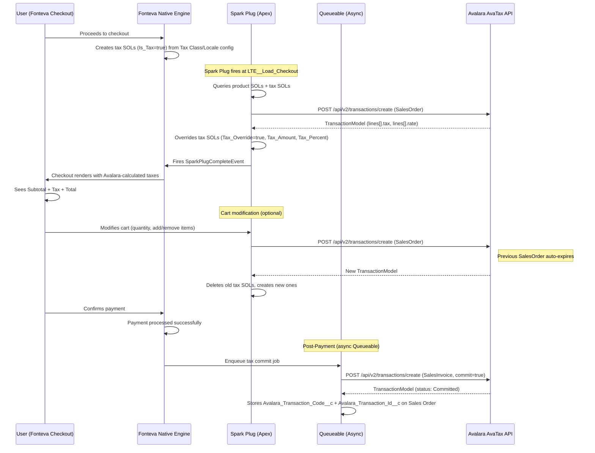
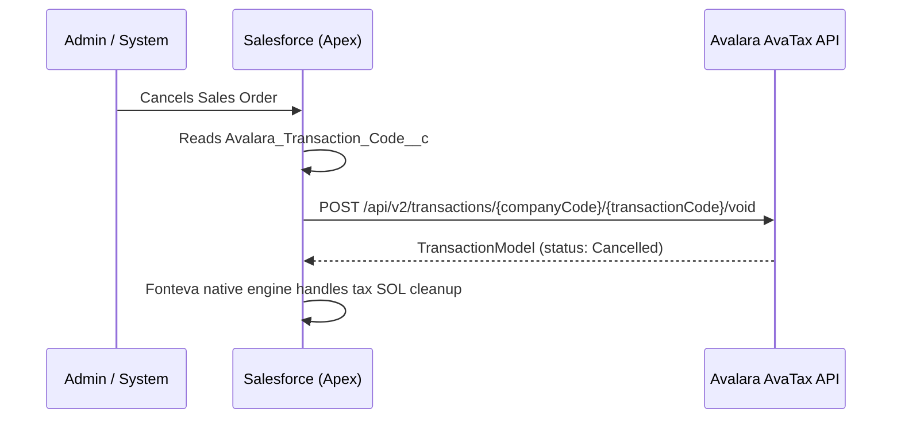
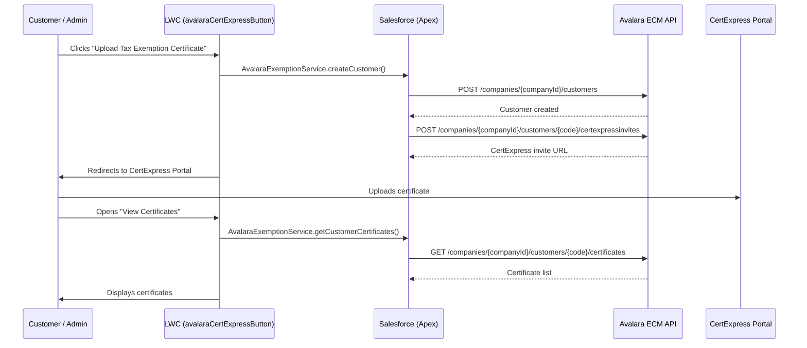

# Avalara AvaTax Implementation Plan:TCH (Direct API)

## 1. Authentication

### 1.1 Method: Basic Auth (License Key)

The [AvaTax REST API v2][avatax-api] uses **Basic HTTP Authentication** with Account ID + Lice
| Item | Value |
|------|-------|
| **Header** | `Authorization: Basic {Base64(accountId:licenseKey)}` 
| **Sandbox URL** | `https://sandbox-rest.avatax.com` |
| **Production URL** | `https://rest.avatax.com` |
| **Required Header** | `X-Avalara-Client: {appName};{appVersion};{machineName};{connectorId}` |
| **Content-Type** | `application/json` |

> **Note**: Avalara **does not use OAuth 2.0** for AvaTax REST v2. Authentication is done via License Key (recommended for connectors) or username/password. The License Key is generated in the admin portal: Settings → Reset License Key (requires admin permission).

**Why License Key over username/password?**
- Higher entropy (more secure against brute-force)
- Does not expire on password resets
- Official Avalara recommendation for connectors

### Suggested Apex Class

| Class | Responsibility |
|-------|---------------|
| `AvalaraAuthProvider` | Builds the `Authorization` header from Named Credential or Custom Metadata. Centralizes authentication logic for all callouts. |

### Salesforce Configuration

| Component | Purpose |
|-----------|---------|
| **Named Credential** `Avalara_AvaTax` | Stores base endpoint + credentials (Basic Auth). Allows switching sandbox/prod without code changes. |
| **Custom Metadata** `Avalara_Config__mdt` | Company Code, environment (sandbox/prod), feature flags (address validation on/off, auto-commit, etc.) |

---

## 2. Service APIs

### 2.1 Address Validation (AvaTax) [`ResolveAddress`][method-resolve-address]

**API Method**: [`ResolveAddress`][
**Endpoint**: `POST /api/v2/addresses/resolve`

| Request Field | Type | Required | Fonteva Mapping |
|---------------|------|----------|-----------------|
| `line1` | String | Yes* | Account/Contact street address |
| `city` | String | Yes* | City |
| `region` | String | Yes* | State |
| `postalCode` | String | Yes* | Postal code |
| `country` | String | Yes | Country (ISO 2-char) |
| `textCase` | String | No | `Upper` or `Mixed` |

> *Minimum required: `postalCode` alone, OR `line1 + city + region`, OR `line1 + postalCode`.

**Response** (`AddressResolutionModel`):
- `validatedAddresses[]`:corrected/normalized addresses
- `coordinates`:latitude/longitude
- `resolutionQuality`:match precision indicator
- `messages[]`:validation warnings

**Task requirement link**: Tax calculation depends on correct jurisdiction. Invalid address = tax calculated for the wrong jurisdiction. Validation is a prerequisite for calculation reliability.

| Apex Class | Responsibility |
|------------|---------------|
| `AvalaraAddressService` | Builds request, calls endpoint, parses response. Main method: `validateAddress(AddressInfo)` |
| `AvalaraAddressRequest` | Request body wrapper (line1, city, region, postalCode, country) |
| `AvalaraAddressResponse` | Response wrapper (validatedAddresses, resolutionQuality, messages) |

---

### 2.2 Tax Calculation (AvaTax):[`CreateTransaction`][method-create-transaction]

**API Method**: [`CreateTransaction`][method-create-transaction]
**Endpoint**: `POST /api/v2/transactions/create`

This is the **core API** of the integration:calculates tax in real time during Fonteva checkout.

#### Document Types

| Type | Persistence | When to Use |
|------|------------|-------------|
| `SalesOrder` | **Temporary** (auto-expires in Avalara) | Checkout: tax estimate before payment. Can be called multiple times (cart changes) with no cleanup needed. |
| `SalesInvoice` | **Permanent** (saved and can be reported) | Post-payment (async): with `commit=true` in a single call. Saves `code` and `id` on Sales Order. |

#### Request Body (`CreateTransactionModel`)

| Field | Type | Required | Description | Fonteva Mapping |
|-------|------|----------|-------------|-----------------|
| `companyCode` | String | Yes | Company identifier in Avalara | Custom Metadata `Avalara_Config__mdt` |
| `type` | Enum | Yes | `SalesOrder` or `SalesInvoice` | Based on checkout stage |
| `date` | DateTime | Yes | Transaction date | `OrderApi__Sales_Order__c.CreatedDate` or current date |
| `customerCode` | String | Yes | Unique customer identifier | `Account.Id` or `Contact.Id` |
| `currencyCode` | String | No | ISO currency (e.g., `USD`) | `OrderApi__Sales_Order__c.CurrencyIsoCode` |
| `commit` | Boolean | No | If `true`, commits automatically | `true` for post-payment SalesInvoice |
| `exemptionNo` | String | No | Exemption certificate number | Checked via ECM before the call |
| `customerUsageType` | String | No | Entity/Use Code (e.g., `A` = Federal Gov) | Custom field on Account or via ECM lookup |
| `addresses` | Object | Yes | ShipFrom/ShipTo addresses | See mapping below |
| `lines[]` | Array | Yes | Transaction line items | `OrderApi__Sales_Order_Line__c` records |

#### Addresses Object

```json
{
  "addresses": {
    "shipFrom": {
      "line1": "TCH company address",
      "city": "...", "region": "...", "postalCode": "...", "country": "US"
    },
    "shipTo": {
      "line1": "Customer address",
      "city": "...", "region": "...", "postalCode": "...", "country": "US"
    }
  }
}
```

#### Lines Array (`LineItemModel`)

| Field | Type | Required | Fonteva Mapping |
|-------|------|----------|-----------------|
| `number` | String | No | Index or `Sales_Order_Line__c.Id` |
| `quantity` | Decimal | Yes | `OrderApi__Quantity__c` |
| `amount` | Decimal | Yes | `OrderApi__Sale_Price__c * Quantity` or `OrderApi__Total__c` |
| `itemCode` | String | No | `OrderApi__Item__c.Name` or `ProductCode` |
| `taxCode` | String | No | Avalara tax code (e.g., `P0000000` = tangible personal property) |
| `description` | String | No | `OrderApi__Item__c.Name` |

#### Response (`TransactionModel`)

| Field | Description | Usage |
|-------|-------------|-------|
| `totalTax` | Total transaction tax | Store on `Sales_Order__c` |
| `totalTaxable` | Total taxable amount | Reference |
| `totalAmount` | Total amount with tax | Reference |
| `lines[].tax` | Tax per line | Store on each `Sales_Order_Line__c` |
| `lines[].taxableAmount` | Taxable amount per line | Reference |
| `lines[].taxCalculated` | Calculated tax per line | Create **Fonteva Adjustment Tax Item** |
| `status` | Transaction status | Control |
| `id` | Avalara ID | Store for later commit/void |
| `code` | Transaction code | Store for reference |

**Task requirement links**:
- *"Use Avalara Tax API to send the additional details required"* → `CreateTransactionModel`
- *"Get the calculation response"* → `TransactionModel` response
- *"Create the Fonteva Adjustment Tax Item records"* → Use `lines[].tax` from response

| Apex Class | Responsibility | Status |
|------------|---------------|--------|
| `AvalaraCreateTransaction` | DTOs: Request, Response, Address, LineItem, ResponseLine, TaxDetail | Deployed |
| `AvalaraCreateTransactionTransformer` | transformRequest(Request→JSON), transformResponse(JSON→Response) | Deployed |
| `AvalaraCreateTransactionService` | execute(Request→Response), orchestrates Transformer + AuthProviderService | Deployed |
| `AvalaraTransactionStatusService` | commitTransaction + voidTransaction (unified, DRY). Reuses `AvalaraCreateTransaction.Response` | Deployed |
| `AvalaraTaxSparkPlugController` | (future) `@AuraEnabled` Apex controller for checkout Spark Plug | Planned |
| `AvalaraTaxLineCreator` | (future) Creates/deletes Fonteva tax SOLs from Avalara response | Planned |

---

### 2.3 Transaction Commit:[`CommitTransaction`][method-commit-transaction]

**API Method**: [`CommitTransaction`][method-commit-transaction]
**Endpoint**: `POST /api/v2/companies/{companyCode}/transactions/{transactionCode}/commit`

Marks the transaction as permanent in Avalara:required for it to appear in tax returns/filings.

| Request Field | Type | Description |
|---------------|------|-------------|
| `commit` | Boolean | Must be `true` |

**When to call**: Auxiliary service for exceptional scenarios only. The primary flow uses `CreateTransaction` with `SalesInvoice` + `commit=true` in a single call post-payment, making a separate CommitTransaction unnecessary in the happy path.

> Covered by `AvalaraTransactionStatusService.commitTransaction(companyCode, transactionCode)`

---

### 2.4 Transaction Void:[`VoidTransaction`][method-void-transaction]

**API Method**: [`VoidTransaction`][method-void-transaction]
**Endpoint**: `POST /api/v2/companies/{companyCode}/transactions/{transactionCode}/void`

Cancels a transaction in Avalara:required for refunds/cancellations.

| Request Field | Type | Description |
|---------------|------|-------------|
| `code` | Enum | `DocVoided` (full cancellation) |

**When to call**: When a Sales Order is cancelled or a refund is processed in Fonteva after the SalesInvoice was already committed.

> Covered by `AvalaraTransactionStatusService.voidTransaction(companyCode, transactionCode)`

#### Implementation: Unified Service (DRY)

Both CommitTransaction and VoidTransaction share the same pattern: path variables (`companyCode`, `transactionCode`) + simple JSON body + same TransactionModel response. They are implemented as a single `AvalaraTransactionStatusService` class with two public methods and one shared private core method. No separate DTO or Transformer needed: request bodies are trivial, response reuses `AvalaraCreateTransaction.Response` via `AvalaraCreateTransactionTransformer.transformResponse()`.

---

### 2.5 Tax Exemption Certificates:[Exemption Certificate Management (ECM) API][ecm-api]

**API Methods**:

| API Method | HTTP | Endpoint | Description |
|------------|------|----------|-------------|
| [`CreateCustomers`][method-create-customers] | `POST` | `/api/v2/companies/{companyId}/customers` | Creates customer in ECM (required before associating certificates) |
| [`ListCertificatesForCustomer`][method-list-certs-customer] | `GET` | `/api/v2/companies/{companyId}/customers/{customerCode}/certificates` | Lists certificates for a customer |
| [`CreateCertificates`][method-create-certificates] | `POST` | `/api/v2/companies/{companyId}/certificates` | Creates/registers a certificate |
| [`GetCertificate`][method-get-certificate] | `GET` | `/api/v2/companies/{companyId}/certificates/{id}` | Queries a specific certificate |
| [`CreateCertExpressInvitation`][method-certexpress-invite] | `POST` | `/api/v2/companies/{companyId}/customers/{customerCode}/certexpressinvites` | Sends CertExpress invite for upload |

#### Automatic Integration with Tax Calculation

When a customer has a valid certificate in ECM, the [AvaTax REST API v2][avatax-api] **automatically applies the exemption** on `CreateTransaction`:just send the correct `customerCode`. Alternatively, you can send:
- `exemptionNo`:certificate number directly in the request
- `customerUsageType` / `entityUseCode`:usage code (e.g., `A` = Federal Gov, `B` = State Gov)

#### CertExpress Portal (for customer certificate upload)

The flow described in the task:
> *"LWC button that will redirect to Avalara guest portal with user creation for tracking purposes"*

This is **CertExpress**:an Avalara portal where the customer uploads certificates. The flow:
1. Create customer in ECM via API
2. Generate CertExpress invite (`certexpressinvites`)
3. Redirect user to the invite URL
4. Avalara manages the upload and validation

**Task requirement links**:
- *"Tax Exemption Certificates"* → [ECM API][ecm-api]
- *"LWC button that will redirect to Avalara guest portal with user creation"* → CertExpress invite
- *"LWC to visualize that user exempt certificates"* → `GET /customers/{code}/certificates`

| Apex Class | Responsibility |
|------------|---------------|
| `AvalaraExemptionService` | Manages certificates: creates customer, queries certificates, generates CertExpress invite. Methods: `createCustomer(accountId)`, `getCustomerCertificates(customerCode)`, `generateCertExpressInvite(customerCode)` |
| `AvalaraCertificateResponse` | Certificate response wrapper |

| LWC Component | Responsibility |
|---------------|---------------|
| `avalaraCertExpressButton` | Button that calls `generateCertExpressInvite` and redirects to Avalara portal |
| `avalaraCertificateViewer` | Lists customer certificates via `getCustomerCertificates`, with status and details |

---

### 2.6 Entity Use Codes:[`ListEntityUseCodes`][method-list-entity-use-codes]

**API Method**: [`ListEntityUseCodes`][method-list-entity-use-codes]
**Endpoint**: `GET /api/v2/definitions/entityusecodes`

Returns the list of available usage/exemption codes (Federal Gov, State Gov, Religious, Educational, etc.). Use to populate UI dropdowns or for validation.

> Covered by `AvalaraExemptionService.getEntityUseCodes()`

---

## 3. Integration Flows

### 3.1 Main Flow: Tax Calculation at Checkout



### 3.2 Cancellation / Void Flow



### 3.3 Tax Exemption Certificates Flow



---

## 5. Fonteva Tax Mechanism: How Taxes Are Applied to Items

### 5.1 Fonteva's Native Tax Architecture

> Source: Official Fonteva documentation (PDFs in `Avalara/Fonteva taxes/`) and org metadata analysis (2026-05-12).

Fonteva has a complete, structured tax system composed of 4 components configured in this order:

#### 1. Tax Class (`OrderApi__Item_Class__c` with `OrderApi__Is_Tax__c = true`)

A Tax Class is an **Item Class** with `Is_Tax__c` checked. It groups Tax Rates together. Each Tax Class auto-creates a Default Tax Rate Item (price 0.00) when saved. Each Tax Class can only have **one** Default Tax Rate.

Key fields on Item Class for tax:
- `OrderApi__Is_Tax__c`: marks this Item Class as a Tax Class
- `OrderApi__Use_Default_Tax_Rate__c`: when checked, applies the same tax rate regardless of the purchaser's locale
- `OrderApi__Is_Taxable__c`: marks items in this class as taxable (separate from Is_Tax)
- `OrderApi__Tax_Class__c`: lookup to another Item Class that IS a Tax Class

#### 2. Tax Locale (`OrderApi__Tax_Locale__c`)

Defines a geographic jurisdiction for tax. Created under a Business Group's related list.

| Field | Type | Description |
|-------|------|-------------|
| `OrderApi__Tax_Locale_Field__c` | Text(255) | API name of the **Sales Order Line** field the system evaluates (e.g., `OrderApi__Shipping_State__c`, `OrderApi__Shipping_Country__c`) |
| `OrderApi__Locale_Values_CSV__c` | LongTextArea | Comma-separated values that match this locale (e.g., `va,VA` or `DC, dc`) |
| `OrderApi__Tax_GL_Account__c` | Lookup(GL Account) | GL Account for tax liability (credit entry on the Sales Order journal) |
| `OrderApi__Business_Group__c` | Lookup | Business Group association |

#### 3. Tax Rate (`OrderApi__Item__c` with `OrderApi__Is_Tax__c = true`)

A Tax Rate is an **Item** record created within a Tax Class (Item Class → Related → Items → New). It defines the flat rate percentage for a specific locale.

| Field | Type | Description |
|-------|------|-------------|
| `OrderApi__Is_Tax__c` | Checkbox | Marks this Item as a Tax Rate |
| `OrderApi__Tax_Locale__c` | Lookup(Tax_Locale__c) | The locale this rate applies to |
| `OrderApi__Tax_Percent__c` | Percent(7,4) | The flat rate percentage |
| `OrderApi__Is_Default_Tax_Rate__c` | Checkbox | Default rate when no locale matches |

Multiple Tax Rates can exist within one Tax Class, one per locale. When a taxable item is purchased, the system selects the Tax Rate that matches the purchaser's locale.

**When a taxable item is purchased, the Tax Rate automatically creates:**
- Sales Order Line(s) with `Is_Tax__c = true`
- Invoice Line(s)
- Receipt Line(s)
- ePayment Line(s)
- GL journal entries: debit Cash, credit Revenue, credit Tax Liabilities GL Account

#### 4. Taxable Item (`OrderApi__Item__c` with `OrderApi__Is_Taxable__c = true`)

Any Item that needs to be taxed at purchase:
- `OrderApi__Is_Taxable__c = true`
- `OrderApi__Tax_Class__c` = lookup to the Tax Class (Item Class with `Is_Tax__c = true`)

That's all that's needed. The system handles the rest at checkout.

### 5.1.1 Current TCH Org State (queried 2026-05-12)

> Data source: `Avalara/Fonteva taxes/Configurations/` (6 JSON files exported from TCH production org)

**All existing tax configuration is Fonteva demo data (FON- prefix). No TCH-specific tax configuration exists.**

| Component | Count | Details |
|-----------|-------|---------|
| Tax Classes | 6 (3 pairs) | `FON-Tax Class`, `FON-Default Tax Class`, `FON-VAT Tax Class`:each duplicated with/without BG=ECCHO |
| Tax Locales | 8 (4 pairs) | VA (6%), DC (8%), France VAT (20%), Default USA (10%):each duplicated with/without BG=ECCHO |
| Tax Rate Items | 8 (4 pairs) | `FON-VA State Tax` (6%), `FON-DC Tax` (8%), `FON-Default Tax Class Default Tax Rate` (10%), `FON-VAT France` (20%) |
| Taxable Items | ~25 | All FON- demo merchandise: Mugs, T-Shirts, Coasters, Jackets, etc. **No TCH real products.** |
| Business Group | 1 | ECCHO (`Required_Tax_Fields_CSV = OrderApi__Shipping_State__c`) |
| GL Accounts | 2 | `2300 - Taxes Payable (Placeholder)` (Liability), `2400 - International Taxes Payable (Placeholder)` (Liability) |

**Implications:**
- TCH's real products (memberships, events, services) are **not configured as taxable**
- GL Accounts are placeholders:real Tax Liabilities account needs to be created or designated by TCH finance
- The Fonteva tax architecture works and is proven (demo data exercises the full path)
- We are **building tax configuration from scratch**, not replacing an existing one

### 5.1.2 Integration Strategy: Avalara Calculates, Fonteva is Product Master

**Separation of responsibilities:**
- **Fonteva (Salesforce)** is the master of products/items. Tax codes are stored on each Item (`Avalara_Tax_Code__c`) and sent in the API request. This follows the principle: the tax code lives where the product lives.
- **Avalara** is the tax calculation engine. It receives the `itemCode` + `taxCode` from Fonteva, applies jurisdiction rules (nexus, rates, exemptions), and returns the calculated tax.
- **No native Fonteva tax configuration** needed (no Tax Class, Tax Locales, Tax Rate Items per state, or `Is_Taxable__c`). This avoids duplicating Avalara's jurisdiction/nexus logic in Fonteva.

> **Why not register products in Avalara's Item Catalog?** Fonteva is the product master. Registering in Avalara would create a second source to maintain in sync:and without the Avalara managed package/connector, there's no automatic sync. If TCH ever installs the connector or migrates the product catalog, this can be revisited: the change is minimal (remove `taxCode` from the request, let Avalara resolve from its catalog).

**What we need from Fonteva:**
- **`Avalara_Tax_Code__c`** on each `OrderApi__Item__c`: stores the Avalara tax code (e.g., `P0000000`, `OD020500`, `NT`). Already mapped in `Avalara/Mapping/SalesforceItemsTaxCodes.csv`.
- **One Tax Rate Item** (`OrderApi__Item__c` with `Is_Tax__c = true`): used as the `OrderApi__Item__c` lookup on tax SOLs. This Item's GL Account (Income Account) determines the Tax Liabilities GL entry.
- **`Tax_Override__c = true`** on every tax SOL: prevents Fonteva's native engine from recalculating

**Downstream records (Invoice Lines, Receipt Lines, ePayment Lines):**
Fonteva's managed package creates these for **all** Sales Order Lines when the Sales Order is processed:not just for SOLs created by the native tax engine. The lookup fields `Sales_Order_Line__c` on Invoice Line, Receipt Line, and ePayment Line are all marked **"System Calculated"** in the metadata, meaning the managed package populates them automatically during posting. Tax SOLs created via Apex are just SOLs like any other.

### 5.2 Spark Plug: Extension Points

> Source: Official Fonteva documentation (`Avalara/Fonteva Spark Plug/*.pdf`)

Fonteva's **Spark Plug** framework injects custom Lightning Components into default process flows via Extension Points. Registration is done via `Framework__Spark_Plug_Extension__mdt`.

#### Extension Point Mapping

| Extension Point | When | Avalara Action | Component | SparkPlugCompleteEvent |
|---|---|---|---|---|
| `Load_Checkout` | Checkout page loads | Validate address + Tax estimate (SalesOrder) + Create tax SOLs | `CYRILCheckoutSparkPlugComponent` (reuse, enable) | Yes |
| `Load_Payment_Confirmation` | Receipt page loads (post-payment) | CreateTransaction (SalesInvoice, commit=true) + Save codes on SO | `CYRILPaymentConfirmationSparkPlugComponent` (reuse) | Yes |
| `Process_Refund` | "Process Refund" button clicked | VoidTransaction + continue via `FDService.RefundService` | New component (future) | **NO** |
| `Add_Validate_Address_Btn` | "Validate" button clicked | ResolveAddress (standalone) | New component (future) | Yes |

#### Extension Points NOT Used

| Extension Point | Reason |
|---|---|
| `Override_Tax_and_Shipping` | For Rapid Order Entry (admin), NOT customer checkout. Also: WARNING from Fonteva docs — do NOT fire `SparkPlugCompleteEvent` with this EP. |
| `Load_Shopping_Cart` | Tax calculation not needed at cart stage |
| `On_Click_Add_to_Order` | No Avalara interaction on add-to-cart |
| `Load_ApplyPayment` / `Load_Invoice_Payment` | Not applicable to checkout tax flow |

#### Existing CMT Records in Org

| CMT Record | Component | Extension Point | Enabled |
|---|---|---|---|
| `Checkout_Sparkplug` | `CYRILCheckoutSparkPlugComponent` | `LTE__Load_Checkout` | **false** (to be enabled for Avalara) |
| `CYRILPaymentConfirmationSparkPlugEP` | `CYRILPaymentConfirmationSparkPlugComponent` | `LTE__Load_Payment_Confirmation` | **true** |

#### Fonteva Spark Plug Rules (from official docs)

- Component must be **global** and implement `FDService:SparkPlugComponentInterface`
- `FDService:SparkPlugLoadedEvent`: fire on init to hide loader
- `FDService:SparkPlugCompleteEvent`: fire when done to show next component or hide container
- **WARNING**: Do NOT fire `SparkPlugCompleteEvent` with `Process_Refund` or `Override_Tax_and_Shipping`
- `Add_Validate_Address_Btn`: requires critical update "Enable ability to use a 3rd party address validation system" in **Spark Admin > Apps > Charge**
- `v.data`: context object from container (salesOrder, gateway, etc.)
- Multiple components on the same EP run in `Order__c` sequence (0 first)

### 5.2.1 Checkout Spark Plug (Load_Checkout)

Reuses `CYRILCheckoutSparkPlugComponent`. On checkout page load:

1. Fire `SparkPlugLoadedEvent`
2. Call Apex orchestrator: validate address → calculate tax → create tax SOLs
3. Fire `SparkPlugCompleteEvent` (always, even on error — to not block checkout)

### 5.2.2 Payment Confirmation Spark Plug (Load_Payment_Confirmation)

Reuses `CYRILPaymentConfirmationSparkPlugComponent`. After payment confirmed:

1. Fire `SparkPlugLoadedEvent`
2. Call Apex: CreateTransaction (SalesInvoice, commit=true)
3. Save `response.code` → `Avalara_Transaction_Code__c` and `response.id` → `Avalara_Transaction_Id__c` on Sales Order
4. Fire `SparkPlugCompleteEvent`

### 5.3 Apex Back-End: Tax Calculation

The Spark Plug's Apex controller orchestrates the Avalara call and creates/updates tax SOLs directly.

#### Prerequisites

1. **Tax Rate Item**: One `OrderApi__Item__c` with `Is_Tax__c = true` and the correct Income Account (GL Account for Tax Liabilities). This is the Item referenced on every tax SOL.
2. **New field**: `Avalara_Tax_Code__c` (Text 25) on `OrderApi__Item__c` for Avalara tax code classification per product.

#### How the flow works

1. Customer adds items to cart and proceeds to checkout
2. Spark Plug fires at `LTE__Load_Checkout`
3. Apex queries all product SOLs on the Sales Order
4. Apex sends product lines to Avalara API (`CreateTransaction`)
5. Avalara returns tax per line (amount, rate, jurisdiction)
6. For each response line: Apex creates a tax SOL with `Is_Tax__c = true`, `Tax_Override__c = true`, and the Avalara-calculated amounts (including $0 tax lines for audit trail)
7. Spark Plug fires `SparkPlugCompleteEvent`
8. Checkout renders with tax (Fonteva natively reads all SOLs and shows Subtotal + Tax + Total)

#### Step 1: Query product lines

```sql
SELECT Id, OrderApi__Item__c, OrderApi__Sale_Price__c, OrderApi__Quantity__c,
       OrderApi__Total__c, OrderApi__Item__r.Name,
       OrderApi__Item__r.Avalara_Tax_Code__c
FROM OrderApi__Sales_Order_Line__c
WHERE OrderApi__Sales_Order__c = :salesOrderId
  AND OrderApi__Is_Tax__c = false
  AND OrderApi__Is_Shipping_Rate__c = false
```

#### Step 2: Build Avalara request

Each product SOL becomes a `line` in the `CreateTransactionModel` (as described in Section 2.2). Avalara determines what's taxable and at what rate:no Fonteva-side `Is_Taxable__c` config needed.

#### Step 3: Delete existing tax SOLs and create new ones

On each Spark Plug fire (including cart modifications), clean up previous tax SOLs and create fresh ones from the Avalara response:

```apex
// Clean up previous Avalara tax SOLs
delete [SELECT Id FROM OrderApi__Sales_Order_Line__c
        WHERE OrderApi__Sales_Order__c = :salesOrderId
          AND OrderApi__Is_Tax__c = true
          AND OrderApi__Tax_Override__c = true];

// Create tax SOL for each taxable line in Avalara response
List<OrderApi__Sales_Order_Line__c> taxLines = new List<OrderApi__Sales_Order_Line__c>();
for (AvalaraResponseLine avalaraLine : response.lines) {
    // Always create tax SOL (even $0) for audit trail
    {
        taxLines.add(new OrderApi__Sales_Order_Line__c(
            OrderApi__Sales_Order__c = salesOrderId,
            OrderApi__Is_Tax__c = true,
            OrderApi__Tax_Override__c = true,
            OrderApi__Tax_Amount__c = avalaraLine.tax,
            OrderApi__Tax_Percent__c = avalaraLine.rate * 100,
            OrderApi__Sale_Price__c = avalaraLine.tax,
            OrderApi__Quantity__c = 1,
            OrderApi__Item__c = taxRateItemId,
            OrderApi__Sales_Order_Line__c = productLineIdMap.get(avalaraLine.lineNumber)
        ));
    }
}
insert taxLines;
```

> **Field notes (validated against org metadata)**:
> - `OrderApi__Sales_Order_Line__c` (self-lookup) links tax SOL to parent product SOL. `OrderApi__Sales_Order_Line_R__c` is for multi-currency reporting:do NOT use.
> - `OrderApi__Tax_Percent__c` is Percent(7,4). Avalara returns `rate` as decimal (e.g., `0.0825`), multiply by 100.
> - `Tax_Override__c = true` prevents Fonteva's native engine from recalculating. Also used as the cleanup identifier (delete all SOLs where `Is_Tax__c = true AND Tax_Override__c = true`).
> - Invoice Lines, Receipt Lines, ePayment Lines are created automatically by the managed package when the Sales Order is processed. The `Sales_Order_Line__c` lookup on these objects is **"System Calculated"**:the managed package populates it for ALL SOLs, regardless of how they were created.

### 5.4 Apex Class Summary

| Class | Responsibility | Status |
|-------|---------------|--------|
| `AvalaraAuthProviderService` | Centralized HTTP client. Named Credential + CMT endpoint registry. | Deployed |
| `AvalaraResolveAddressService` | Address validation (DTO+Transformer+Service) | Deployed |
| `AvalaraCreateTransactionService` | Tax calculation (DTO+Transformer+Service) | Developed |
| `AvalaraTransactionStatusService` | Commit + Void (unified, DRY) | Developed |
| `AvalaraTaxCalculationService` | **Orchestrator**: validate address → calculate tax → create/delete tax SOLs. Entry point: `calculateTax(Id salesOrderId)` | Planned |
| `AvalaraTaxCommitService` | **Post-payment orchestrator**: CreateTransaction (SalesInvoice, commit=true) + save codes on SO. Entry point: `commitTax(Id salesOrderId)` | Planned |

| Component | Extension Point | Responsibility |
|-----------|---|---------------|
| `CYRILCheckoutSparkPlugComponent` | `LTE__Load_Checkout` | Calls `AvalaraTaxCalculationService.calculateTax()`, fires `SparkPlugLoadedEvent` + `SparkPlugCompleteEvent` |
| `CYRILPaymentConfirmationSparkPlugComponent` | `LTE__Load_Payment_Confirmation` | Calls `AvalaraTaxCommitService.commitTax()`, fires `SparkPlugLoadedEvent` + `SparkPlugCompleteEvent` |

### 5.5 Key Design Decisions

| # | Decision | Rationale |
|---|----------|-----------|
| 1 | **Fonteva is product master, Avalara is tax engine** | Tax codes live where the products live (`Avalara_Tax_Code__c` on Item). Avalara calculates jurisdiction/rates. No native Fonteva tax config (Tax Class/Locale/Rate) needed:avoids duplicating Avalara's logic. See Section 5.1.2. |
| 2 | **Downstream records propagate automatically** | Invoice Lines, Receipt Lines, ePayment Lines are created by the managed package for ALL SOLs when the Sales Order is processed. The `Sales_Order_Line__c` lookup is "System Calculated". Tax SOLs created via Apex are treated like any other SOL. |
| 3 | **Delete + recreate on every Spark Plug fire** | Simpler than matching/updating. On cart modification, old tax SOLs are deleted (`Is_Tax__c = true AND Tax_Override__c = true`) and fresh ones created from Avalara response. |
| 4 | **Self-lookup field**: `OrderApi__Sales_Order_Line__c` | Links tax SOL to parent product SOL. `OrderApi__Sales_Order_Line_R__c` is for multi-currency reporting:do NOT use. |
| 5 | **Tax SOL per product line (including $0)** | One tax SOL per response line for granularity and audit trail. Even $0 tax lines are created to show Avalara was called and determined no tax. |
| 6 | **Checkout = SalesOrder, Post-payment = SalesInvoice+commit** | SalesOrder auto-expires if checkout fails or cart changes. SalesInvoice only created after payment confirmed. No orphaned transactions. |
| 7 | **Reuse existing CYRIL components** | `CYRILCheckoutSparkPlugComponent` and `CYRILPaymentConfirmationSparkPlugComponent` already registered at the correct extension points. Adapt with Avalara logic instead of creating new components. |

---

## 6. Task Requirements → API Mapping

| Task Requirement | API Method | Endpoint | Apex Classes |
|------------------|------------|----------|-------------|
| *"Avalara creds"* | Basic Auth | `Authorization` header | `AvalaraAuthProvider`, Named Credential |
| *"Add Fonteva Items records to Avalara Portal"* | N/A with direct API | Mapped via `lines[]` in request | `AvalaraLineItem` |
| *"Configure US States that are taxable"* | Avalara Portal (Nexus) | Admin portal:not an API | N/A |
| *"Use Avalara Tax API to send additional details"* | [`CreateTransaction`][method-create-transaction] | `POST /transactions/create` | `AvalaraTaxService`, `AvalaraTransactionRequest` |
| *"Get the calculation response"* | [`CreateTransaction`][method-create-transaction] | `TransactionModel` response | `AvalaraTransactionResponse` |
| *"Create Fonteva Adjustment Tax Item records"* | N/A (Salesforce logic) | Apex DML:override native tax SOLs | `AvalaraTaxLineOverrider` |
| *"Tax Exemption Certificates"* | [`CreateCustomers`][method-create-customers] / [`CreateCertificates`][method-create-certificates] | `/customers`, `/certificates` | `AvalaraExemptionService` |
| *"LWC button → redirect to Avalara guest portal"* | [`CreateCertExpressInvitation`][method-certexpress-invite] | `/certexpressinvites` | `avalaraCertExpressButton` LWC |
| *"LWC to visualize user exempt certificates"* | [`ListCertificatesForCustomer`][method-list-certs-customer] | `GET /customers/{code}/certificates` | `avalaraCertificateViewer` LWC |

---

## 7. Pending Item
### Resolved

- ~~**ECM not provisioned**~~:**Resolved (2026-05-12).** Was returning `AccountNotProvisioned`. Fixed by enabling ECM in Avalara portal. CertExpress and certificate viewer LWCs can now proceed.

### Defaults (proceed with development, TCH reviews before go-live)

We use sensible defaults for all items below so development is not blocked. TCH team reviews and adjusts during UAT.

| Item | Default | TCH Review Needed |
|------|---------|-------------------|
| **ShipFrom address** | Configured in `Avalara_Config__mdt`. Use TCH's registered business address (asked in TeamWork, pending confirmation). | TCH confirms the exact address before go-live |
| **Tax codes** | All items default to `P0000000` (tangible personal property). Stored in `Avalara_Tax_Code__c` per Item. | TCH business/tax team reclassifies products (SaaS, services, memberships, events):different types are taxed differently per state |
| **Non-taxable products** | All items sent to Avalara. Avalara determines taxability per jurisdiction. | TCH reviews which products need specific tax codes (non-default) |
| **GL Account** | Tax Rate Item uses `2300 - Taxes Payable (Placeholder)` as Income Account. | TCH finance confirms or provides the real Tax Liabilities GL Account |

### Resolved

- ~~Avalara sandbox credentials~~:API working (Account ID: 2000002768)
- ~~Company Code~~:available in sandbox
- ~~Nexus states~~:configured in Avalara portal (confirmed via `ListNexusByCompany`)
- ~~Fonteva tax line structure~~:`OrderApi__Sales_Order_Line__c` with `Is_Tax__c = true`, validated against org metadata
- ~~Checkout integration point~~:Spark Plug at `LTE__Load_Checkout`

### Implementation Setup (done by us)

1. **Tax Rate Item.** Create one `OrderApi__Item__c` with `Is_Tax__c = true` and Income Account set to `2300 - Taxes Payable`. Referenced on every Avalara-created tax SOL for GL accounting.

2. **New custom fields to deploy:**
    - `Avalara_Tax_Code__c` (Text 25) on `OrderApi__Item__c`:Avalara tax code per product
    - `Avalara_Transaction_Code__c` (Text 50) on `OrderApi__Sales_Order__c`:for commit/void
    - `Avalara_Transaction_Id__c` (Text 20) on `OrderApi__Sales_Order__c`:optional portal reference
    - `Avalara_Config__mdt`:Custom Metadata Type with the following fields:

    | Field | Type | Description | Example |
    |-------|------|-------------|---------|
    | `Company_Code__c` | Text(25) | Avalara Company Code, sent in every `CreateTransaction` request | `TCH_PROD` |
    | `Environment__c` | Picklist | Determines which Avalara endpoint to use | `Sandbox` / `Production` |
    | `ShipFrom_Street__c` | Text(255) | TCH business address: street (origin for tax jurisdiction) | `2 Liberty Place, 50 S 16th St` |
    | `ShipFrom_City__c` | Text(100) | TCH business address: city | `New York` |
    | `ShipFrom_State__c` | Text(2) | TCH business address: state code | `NY` |
    | `ShipFrom_PostalCode__c` | Text(10) | TCH business address: zip | `10006` |
    | `ShipFrom_Country__c` | Text(2) | TCH business address: country (ISO 2-char) | `US` |
    | `Auto_Commit__c` | Checkbox | If true, `SalesInvoice` transactions send `commit: true` automatically | `true` |
    | `Enable_Address_Validation__c` | Checkbox | If true, validates ShipTo address via `ResolveAddress` before tax calculation | `false` |
    | `Default_Tax_Code__c` | Text(25) | Fallback Avalara tax code when `Avalara_Tax_Code__c` is blank on an Item | `P0000000` |

---

## 8. API References

### API Products

| API Name | Documentation |
|----------|---------------|
| AvaTax REST API v2 | https://developer.avalara.com/products/avatax/api/ |
| Exemption Certificate Management (ECM) | https://developer.avalara.com/products/ecm/api/certcapture/ |
| Avalara API Reference (all products) | https://developer.avalara.com/api-reference/ |

### API Methods Used in This Integration

| Method | Category | Documentation |
|--------|----------|---------------|
| `ResolveAddress` | Addresses | https://developer.avalara.com/products/avatax/api/methods/Addresses/ResolveAddress/ |
| `CreateTransaction` | Transactions | https://developer.avalara.com/products/avatax/api/methods/Transactions/CreateTransaction/ |
| `CommitTransaction` | Transactions | https://developer.avalara.com/products/avatax/api/methods/Transactions/CommitTransaction/ |
| `VoidTransaction` | Transactions | https://developer.avalara.com/products/avatax/api/methods/Transactions/VoidTransaction/ |
| `CreateCustomers` | Customers | https://developer.avalara.com/products/avatax/api/methods/Customers/CreateCustomers/ |
| `ListCertificatesForCustomer` | Customers | https://developer.avalara.com/products/avatax/api/methods/Customers/ListCertificatesForCustomer/ |
| `CreateCertificates` | Certificates | https://developer.avalara.com/products/avatax/api/methods/Certificates/CreateCertificates/ |
| `GetCertificate` | Certificates | https://developer.avalara.com/products/avatax/api/methods/Certificates/GetCertificate/ |
| `CreateCertExpressInvitation` | CertExpressInvites | https://developer.avalara.com/products/avatax/api/methods/CertExpressInvites/CreateCertExpressInvitation/ |
| `ListEntityUseCodes` | Definitions | https://developer.avalara.com/products/avatax/api/methods/Definitions/ListEntityUseCodes/ |

### Developer Guides

| Guide | Documentation |
|-------|---------------|
| Authentication | https://developer.avalara.com/avatax/authentication-in-rest/ |
| Transactions | https://developer.avalara.com/avatax/dev-guide/transactions/ |
| Document Types | https://developer.avalara.com/avatax/dev-guide/transactions/document-types/ |
| Exemptions | https://developer.avalara.com/avatax/dev-guide/exemptions/ |
| Entity Use Codes | https://developer.avalara.com/avatax/dev-guide/exemptions/exemptions-for-usage/ |

[avatax-api]: https://developer.avalara.com/products/avatax/api/
[ecm-api]: https://developer.avalara.com/products/ecm/api/certcapture/
[method-resolve-address]: https://developer.avalara.com/products/avatax/api/methods/Addresses/ResolveAddress/
[method-create-transaction]: https://developer.avalara.com/products/avatax/api/methods/Transactions/CreateTransaction/
[method-commit-transaction]: https://developer.avalara.com/products/avatax/api/methods/Transactions/CommitTransaction/
[method-void-transaction]: https://developer.avalara.com/products/avatax/api/methods/Transactions/VoidTransaction/
[method-create-customers]: https://developer.avalara.com/products/avatax/api/methods/Customers/CreateCustomers/
[method-list-certs-customer]: https://developer.avalara.com/products/avatax/api/methods/Customers/ListCertificatesForCustomer/
[method-create-certificates]: https://developer.avalara.com/products/avatax/api/methods/Certificates/CreateCertificates/
[method-get-certificate]: https://developer.avalara.com/products/avatax/api/methods/Certificates/GetCertificate/
[method-certexpress-invite]: https://developer.avalara.com/products/avatax/api/methods/CertExpressInvites/CreateCertExpressInvitation/
[method-list-entity-use-codes]: https://developer.avalara.com/products/avatax/api/methods/Definitions/ListEntityUseCodes/
