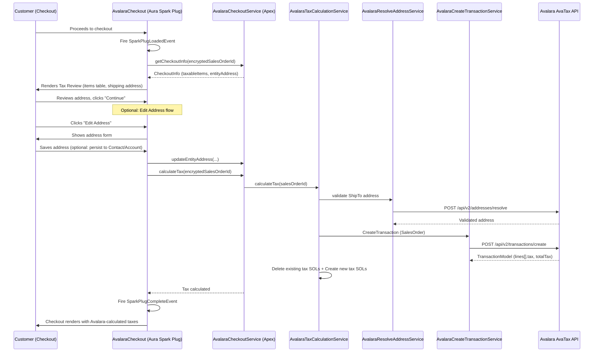
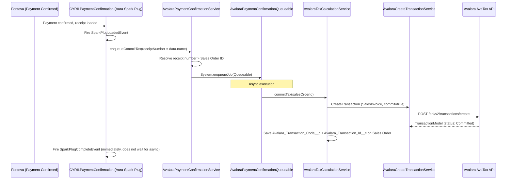
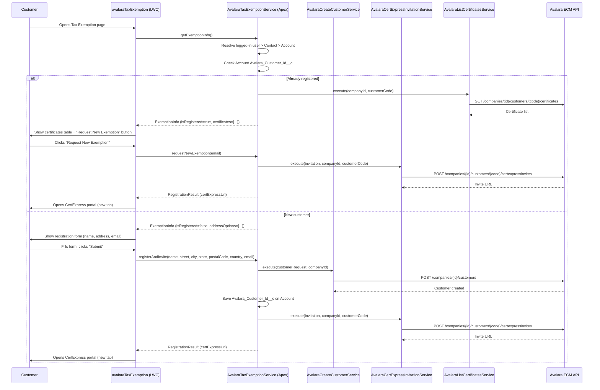
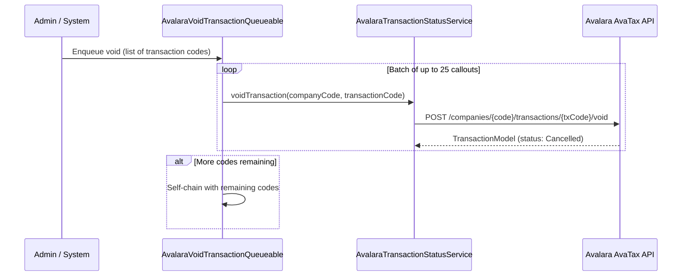

# Avalara AvaTax Integration Plan: TCH (Direct API)

> Last updated: 2026-05-25
> Branch: `feature/26657020`
> Status: Checkout + Post-Payment + Tax Exemption (ECM) COMPLETE. Refund flow TBD.

## 1. Authentication

### 1.1 Method: Basic Auth (License Key)

The AvaTax REST API v2 uses **Basic HTTP Authentication** with Account ID + License Key.

| Item | Value |
|------|-------|
| **Header** | `Authorization: Basic {Base64(accountId:licenseKey)}` |
| **Sandbox URL** | `https://sandbox-rest.avatax.com` |
| **Production URL** | `https://rest.avatax.com` |
| **Required Header** | `X-Avalara-Client: {appName};{appVersion};{machineName};{connectorId}` |
| **Content-Type** | `application/json` |

> **Note**: Avalara does not use OAuth 2.0 for AvaTax REST v2. Authentication uses License Key (recommended for connectors), generated in the admin portal: Settings > Reset License Key.

### 1.2 Salesforce Configuration

| Component | Purpose |
|-----------|---------|
| **Named Credential** `Avalara_AvaTax_Sandbox` | Stores sandbox endpoint + credentials (Basic Auth) |
| **Named Credential** `Avalara_AvaTax_Production` | Stores production endpoint + credentials |
| **External Credential** `Avalara_AvaTax_Sandbox` | Underlying auth for sandbox Named Credential |
| **External Credential** `Avalara_AvaTax_Production` | Underlying auth for production Named Credential |
| **Remote Site Setting** `Avalara_AvaTax_Sandbox` | Allows callouts to sandbox |
| **Remote Site Setting** `Avalara_AvaTax_Production` | Allows callouts to production |
| **Permission Set** `Avalara_API_Access` | Grants external credential access to users |
| **Custom Metadata** `Avalara_Config__mdt` | Company Code, environment, ShipFrom address, feature flags |
| **Custom Metadata** `Avalara_Service__mdt` | API endpoint registry (HTTP method + resource path per API) |

### 1.3 Apex Implementation

| Class | Responsibility |
|-------|---------------|
| `AvalaraAuthProviderService` | Centralized HTTP client. Resolves endpoint from `Avalara_Service__mdt` by DeveloperName. Dynamically selects Named Credential (Sandbox/Production) based on org type. Handles path variable substitution. |

**Inner Classes:**
- `AvalaraCalloutRequest`: encapsulates service name, path variables, and JSON body
- `CalloutParams`: internal callout parameters (httpMethod, apiPath, requestBody)
- `AvalaraException`: custom exception for Avalara API errors

---

## 2. Service APIs

### 2.1 Address Validation: `ResolveAddress`

**Endpoint**: `POST /api/v2/addresses/resolve`

Validates and normalizes US/Canadian addresses. Returns corrected address with geolocation.

| Apex Class | Responsibility |
|------------|---------------|
| `AvalaraResolveAddress` | DTOs: Request (line1, city, region, postalCode, country, textCase), Response (validatedAddresses, coordinates, resolutionQuality, taxAuthorities, messages) |
| `AvalaraResolveAddressTransformer` | `transformRequest(Request)` > JSON, `transformResponse(JSON)` > Response |
| `AvalaraResolveAddressService` | `execute(Request)` > Response. Orchestrates Transformer + AuthProviderService |

---

### 2.2 Tax Calculation: `CreateTransaction`

**Endpoint**: `POST /api/v2/transactions/create`

Core API of the integration: calculates tax in real time during Fonteva checkout.

#### Document Types

| Type | Persistence | When to Use |
|------|------------|-------------|
| `SalesOrder` | Temporary (auto-expires) | Checkout: tax estimate before payment. Can be called multiple times. |
| `SalesInvoice` | Permanent (saved in Avalara) | Post-payment (async): with `commit=true` in a single call. |

| Apex Class | Responsibility |
|------------|---------------|
| `AvalaraCreateTransaction` | DTOs: Request (companyCode, type, date, customerCode, currencyCode, commit, addresses, lines), Response (id, code, status, totalTax, totalTaxable, totalAmount, totalExempt, lines with TaxDetail) |
| `AvalaraCreateTransactionTransformer` | `transformRequest(Request)` > JSON, `transformResponse(JSON)` > Response. Manual serialization for full control over field naming. |
| `AvalaraCreateTransactionService` | `execute(Request)` > Response. Orchestrates Transformer + AuthProviderService |

---

### 2.3 Transaction Commit: `CommitTransaction`

**Endpoint**: `POST /api/v2/companies/{companyCode}/transactions/{transactionCode}/commit`

Marks transaction as permanent. Auxiliary service: the primary flow uses `CreateTransaction` with `SalesInvoice` + `commit=true`.

> Covered by `AvalaraTransactionStatusService.commitTransaction(companyCode, transactionCode)`

---

### 2.4 Transaction Void: `VoidTransaction`

**Endpoint**: `POST /api/v2/companies/{companyCode}/transactions/{transactionCode}/void`

Cancels a committed transaction. Used for refunds/cancellations.

> Covered by `AvalaraTransactionStatusService.voidTransaction(companyCode, transactionCode)`

| Apex Class | Responsibility |
|------------|---------------|
| `AvalaraTransactionStatusService` | Unified service for Commit + Void (DRY). Two public methods + shared core. Reuses `AvalaraCreateTransaction.Response` via `AvalaraCreateTransactionTransformer.transformResponse()` |
| `AvalaraVoidTransactionQueueable` | Async Queueable for batch void operations (up to 25 callouts/execution). Self-chains for remaining codes. Each callout wrapped in try/catch. |

---

### 2.5 Tax Exemption Certificates (ECM)

| API Method | HTTP | Endpoint | Apex Classes |
|------------|------|----------|-------------|
| `CreateCustomers` | `POST` | `/api/v2/companies/{companyId}/customers` | AvalaraCreateCustomer (DTO), AvalaraCreateCustomerTransformer, AvalaraCreateCustomerService |
| `ListCertificatesForCustomer` | `GET` | `/api/v2/companies/{companyId}/customers/{customerCode}/certificates` | AvalaraListCertificates (DTO), AvalaraListCertificatesTransformer, AvalaraListCertificatesService |
| `CreateCertExpressInvitation` | `POST` | `/api/v2/companies/{companyId}/customers/{customerCode}/certexpressinvites` | AvalaraCertExpressInvitation (DTO), AvalaraCertExpressInvitationTransformer, AvalaraCertExpressInvitationService |

#### CertExpress Flow

1. Customer visits Tax Exemption page (LWC: `avalaraTaxExemption`)
2. If new customer: registers in Avalara ECM via `CreateCustomers` API
3. Generates CertExpress invitation link
4. Redirects customer to Avalara CertExpress portal (opens in new tab)
5. For returning customers: shows existing certificates table + "Request New Exemption" button (skips re-registration)
6. Avalara `Customer ID` persisted on `Account.Avalara_Customer_Id__c` to avoid duplicate registrations

---

## 3. Integration Flows

### 3.1 Main Flow: Tax Calculation at Checkout

**Key Implementation Details:**
- Component: `AvalaraCheckout` (Aura) registered at `LTE__Load_Checkout` via `CYRILCheckoutSparkPlugComponent` delegation
- Multi-step UI: Loading > Review (shows items + address) > Edit Address (optional) > Processing > Complete
- Address can be edited inline; optionally saved to Contact/Account for future purchases
- Tax exemption banner shown with link to `/s/tax-exemption` page (path from `Avalara_Config__mdt.Tax_Exemption_Page_Path__c`)

### 3.2 Post-Payment: Tax Commit

**Key Implementation Details:**
- Component: `CYRILPaymentConfirmationSparkPlugComponent` (existing, enhanced with Avalara call)
- `data.name` = receipt number (from Fonteva SparkPlug context)
- Commit runs asynchronously via `AvalaraPaymentConfirmationQueueable` to avoid blocking the receipt page
- Transaction code and ID persisted on Sales Order for future void operations

### 3.3 Tax Exemption Certificates Flow

### 3.4 Void Transaction Flow (trigger TBD)

> **Note**: The void trigger (e.g., Sales Order status change to Cancelled) is not yet implemented. The service layer and async infrastructure are ready.

---

## 4. Fonteva Tax Mechanism: How Taxes Are Applied

### 4.1 Integration Strategy: Avalara Calculates, Fonteva is Product Master

**Separation of responsibilities:**
- **Fonteva (Salesforce)**: product master. Tax codes stored on each Item (`Avalara_Tax_Code__c`) and sent in the API request.
- **Avalara**: tax calculation engine. Receives `itemCode` + `taxCode`, applies jurisdiction rules (nexus, rates, exemptions), returns calculated tax.
- **No native Fonteva tax configuration** needed (no Tax Class, Tax Locales, Tax Rate Items per state). This avoids duplicating Avalara's jurisdiction/nexus logic.

### 4.2 Spark Plug Architecture

| Extension Point | When | Component | Controller |
|---|---|---|---|
| `LTE__Load_Checkout` | Checkout page loads | `AvalaraCheckout` (delegated from `CYRILCheckoutSparkPlugComponent`) | `AvalaraCheckoutService` |
| `LTE__Load_Payment_Confirmation` | Receipt page loads | `CYRILPaymentConfirmationSparkPlugComponent` | `GetCYRILPCSparkPlugController` + `AvalaraPaymentConfirmationService` |
| `Process_Refund` | Refund button clicked | TBD | TBD |

### 4.3 Tax Line Creation Pattern

On each checkout Spark Plug fire:
1. Delete existing Avalara tax SOLs (`Is_Tax__c = true AND Tax_Override__c = true`)
2. Query product SOLs (exclude `Is_Tax__c = true` and `Is_Shipping_Rate__c = true`)
3. Build Avalara request with line items + tax codes
4. Call CreateTransaction (SalesOrder)
5. For each response line: create a tax SOL with Avalara-calculated amounts (including $0 for audit trail)

**Tax SOL fields set:**
- `OrderApi__Is_Tax__c = true`
- `OrderApi__Tax_Override__c = true` (prevents Fonteva recalculation; also used as cleanup identifier)
- `OrderApi__Tax_Amount__c` = `lines[].tax`
- `OrderApi__Tax_Percent__c` = `lines[].rate * 100` (Percent(7,4))
- `OrderApi__Sale_Price__c` = `lines[].tax`
- `OrderApi__Quantity__c = 1`
- `OrderApi__Item__c` = Tax Rate Item ID (for GL accounting)
- `OrderApi__Sales_Order_Line__c` = parent product SOL ID (self-lookup)

> **Downstream propagation**: Invoice Lines, Receipt Lines, ePayment Lines are created automatically by the managed package for ALL SOLs when the Sales Order is processed.

---

## 5. Apex Class Summary

### 5.1 Authentication Layer

| Class | Responsibility |
|-------|---------------|
| `AvalaraAuthProviderService` | Centralized HTTP client. Named Credential + CMT endpoint registry (`Avalara_Service__mdt`). Dynamic Sandbox/Production selection. |

### 5.2 Address Validation (DTO + Transformer + Service)

| Class | Responsibility |
|-------|---------------|
| `AvalaraResolveAddress` | DTOs: Request, Response, Address, Coordinates, TaxAuthority, Message |
| `AvalaraResolveAddressTransformer` | JSON serialization/deserialization |
| `AvalaraResolveAddressService` | Orchestrator: `execute(Request)` > Response |

### 5.3 Tax Calculation (DTO + Transformer + Service)

| Class | Responsibility |
|-------|---------------|
| `AvalaraCreateTransaction` | DTOs: Request, Address, LineItem, Response, ResponseLine, TaxDetail |
| `AvalaraCreateTransactionTransformer` | Manual JSON serialization with helper methods |
| `AvalaraCreateTransactionService` | Orchestrator: `execute(Request)` > Response |

### 5.4 Transaction Status (Commit + Void)

| Class | Responsibility |
|-------|---------------|
| `AvalaraTransactionStatusService` | Unified commit + void. Reuses `AvalaraCreateTransaction.Response` |
| `AvalaraVoidTransactionQueueable` | Async batch void (25 callouts/execution, self-chaining) |

### 5.5 ECM: Customer Registration

| Class | Responsibility |
|-------|---------------|
| `AvalaraCreateCustomer` | DTOs: Request (customerCode, name, address, email), Response |
| `AvalaraCreateCustomerTransformer` | JSON serialization (wraps in array per API spec) |
| `AvalaraCreateCustomerService` | Orchestrator: `execute(Request, companyId)` > Response |

### 5.6 ECM: CertExpress Invitation

| Class | Responsibility |
|-------|---------------|
| `AvalaraCertExpressInvitation` | DTOs: Request (recipient, coverLetterTitle, deliveryMethod), Response (requestLink, status) |
| `AvalaraCertExpressInvitationTransformer` | JSON serialization (wraps in array, extracts nested invitation) |
| `AvalaraCertExpressInvitationService` | Orchestrator: `execute(Request, companyId, customerCode)` > Response |

### 5.7 ECM: Certificate Listing

| Class | Responsibility |
|-------|---------------|
| `AvalaraListCertificates` | DTOs: Response (recordsetCount, certificates), Certificate (id, status, signedDate, expirationDate, exposureZoneName, exemptionReasonName) |
| `AvalaraListCertificatesTransformer` | JSON deserialization (paginated envelope, nested objects) |
| `AvalaraListCertificatesService` | Orchestrator: `execute(companyId, customerCode)` > Response |

### 5.8 Business Orchestrators

| Class | Responsibility |
|-------|---------------|
| `AvalaraTaxCalculationService` | End-to-end orchestrator: validate address > calculate tax > create/delete tax SOLs. Entry points: `calculateTax(Id)`, `commitTax(Id)` |
| `AvalaraCheckoutService` | `@AuraEnabled` controller for AvalaraCheckout Spark Plug. `getCheckoutInfo()`, `updateEntityAddress()`, `calculateTax()`, `getExemptionPagePath()` |
| `AvalaraPaymentConfirmationService` | `@AuraEnabled` controller for post-payment. `enqueueCommitTax(receiptNumber)`. Resolves receipt > Sales Order > enqueues Queueable. |
| `AvalaraPaymentConfirmationQueueable` | Queueable that calls `AvalaraTaxCalculationService.commitTax()` asynchronously |
| `AvalaraTaxExemptionService` | `@AuraEnabled` controller for avalaraTaxExemption LWC. `getExemptionInfo()`, `registerAndInvite()`, `requestNewExemption()` |

### 5.9 UI Components

| Component | Type | Controller | Purpose |
|-----------|------|-----------|---------|
| `AvalaraCheckout` | Aura | `AvalaraCheckoutService` | Checkout Spark Plug: tax review, address edit, tax calculation trigger. Registered at `LTE__Load_Checkout`. |
| `CYRILCheckoutSparkPlugComponent` | Aura | (delegator) | Original Spark Plug shell. Delegates to `AvalaraCheckout`. |
| `CYRILPaymentConfirmationSparkPlugComponent` | Aura | `GetCYRILPCSparkPlugController` | Post-payment Spark Plug. Enhanced with `enqueueAvalaraCommit()` call. |
| `avalaraTaxExemption` | LWC | `AvalaraTaxExemptionService` | Tax Exemption page: registration form, address selection, certificate viewer, CertExpress redirect. |

### 5.10 Test Classes

| Test Class | Tests | Covers |
|------------|-------|--------|
| `AvalaraAuthProviderServiceTest` | Auth, HTTP client, Named Credential selection | AvalaraAuthProviderService |
| `AvalaraResolveAddressTransformerTest` | Request/Response transformation | AvalaraResolveAddressTransformer |
| `AvalaraResolveAddressServiceTest` | End-to-end address validation | AvalaraResolveAddressService |
| `AvalaraCreateTransactionTransformerTest` | Request/Response transformation | AvalaraCreateTransactionTransformer |
| `AvalaraCreateTransactionServiceTest` | End-to-end tax calculation | AvalaraCreateTransactionService |
| `AvalaraTransactionStatusServiceTest` | Commit + Void operations | AvalaraTransactionStatusService |
| `AvalaraVoidTransactionQueueableTest` | Batch void + self-chaining | AvalaraVoidTransactionQueueable |
| `AvalaraTaxCalculationServiceTest` | Orchestrator: calculateTax + commitTax | AvalaraTaxCalculationService |
| `AvalaraCheckoutServiceTest` | Checkout controller: getCheckoutInfo, calculateTax | AvalaraCheckoutService |
| `AvalaraCreateCustomerTransformerTest` | Customer request/response transformation | AvalaraCreateCustomerTransformer |
| `AvalaraCreateCustomerServiceTest` | Customer registration | AvalaraCreateCustomerService |
| `AvalaraCertExpressInviteTransformerTest` | Invitation request/response transformation | AvalaraCertExpressInvitationTransformer |
| `AvalaraCertExpressInvitationServiceTest` | CertExpress invitation generation | AvalaraCertExpressInvitationService |
| `AvalaraListCertificatesTransformerTest` | Certificate list parsing | AvalaraListCertificatesTransformer |
| `AvalaraListCertificatesServiceTest` | Certificate listing | AvalaraListCertificatesService |
| `AvalaraTaxExemptionServiceTest` | Tax exemption controller (8 tests) | AvalaraTaxExemptionService |

---

## 6. Custom Metadata Configuration

### 6.1 `Avalara_Config__mdt` (Company Configuration)

| Field | Type | Description | Sandbox Value |
|-------|------|-------------|---------------|
| `Company_Code__c` | Text(25) | Avalara Company Code | `TCHPC` |
| `Company_Id__c` | Text(25) | Avalara Company ID (numeric, for ECM APIs) | `312140` |
| `Environment__c` | Picklist | Sandbox / Production | `Sandbox` |
| `Is_Active__c` | Checkbox | Active configuration flag | `true` |
| `ShipFrom_Street__c` | Text(255) | TCH business address: street | `1114 Avenue of The Americas, 17th Floor` |
| `ShipFrom_City__c` | Text(100) | TCH business address: city | `New York` |
| `ShipFrom_State__c` | Text(2) | TCH business address: state code | `NY` |
| `ShipFrom_PostalCode__c` | Text(10) | TCH business address: postal code | `10036` |
| `ShipFrom_Country__c` | Text(2) | TCH business address: country (ISO 2-char) | `US` |
| `Default_Tax_Code__c` | Text(25) | Fallback Avalara tax code when Item's `Avalara_Tax_Code__c` is blank | (null) |
| `Tax_Exemption_Page_Path__c` | Text(255) | Community page path for Tax Exemption LWC | `/LightningMemberPortal/s/tax-exemption` |

**Records:** `Avalara_Config.Sandbox`, `Avalara_Config.Production`

### 6.2 `Avalara_Service__mdt` (API Endpoint Registry)

| Record DeveloperName | HTTP Method | Resource Path |
|---------------------|-------------|---------------|
| `Ping` | GET | `/api/v2/utilities/ping` |
| `Resolve_Address` | POST | `/api/v2/addresses/resolve` |
| `Create_Transaction` | POST | `/api/v2/transactions/create` |
| `Commit_Transaction` | POST | `/api/v2/companies/{companyCode}/transactions/{transactionCode}/commit` |
| `Void_Transaction` | POST | `/api/v2/companies/{companyCode}/transactions/{transactionCode}/void` |
| `Query_Companies` | GET | `/api/v2/companies` |
| `List_Nexus_By_Company` | GET | `/api/v2/companies/{companyId}/nexus` |
| `List_Entity_Use_Codes` | GET | `/api/v2/definitions/entityusecodes` |
| `Create_Customers` | POST | `/api/v2/companies/{companyId}/customers` |
| `Create_CertExpress_Invitation` | POST | `/api/v2/companies/{companyId}/customers/{customerCode}/certexpressinvites` |
| `List_Certificates_For_Customer` | GET | `/api/v2/companies/{companyId}/customers/{customerCode}/certificates` |

---

## 7. Custom Fields

### On `OrderApi__Item__c`

| Field | Type | Description |
|-------|------|-------------|
| `Avalara_Tax_Code__c` | Text(25) | Avalara Tax Code per product (e.g., `P0000000`, `SW054000`, `NT`) |

### On `OrderApi__Sales_Order__c`

| Field | Type | Description |
|-------|------|-------------|
| `Avalara_Transaction_Code__c` | Text(50) | Avalara transaction code for commit/void operations |
| `Avalara_Transaction_Id__c` | Text(20) | Avalara numeric transaction ID (portal reference) |

### On `Account`

| Field | Type | Description |
|-------|------|-------------|
| `Avalara_Customer_Id__c` | Text | Avalara ECM customer ID. Prevents duplicate CreateCustomers calls. |

---

## 8. Nexus Configuration (Avalara Portal)

Tax nexus configured in Avalara sandbox for the following US states:

| State | Nexus | Tax Basis |
|-------|-------|-----------|
| DC (District of Columbia) | Yes | Destination-based |
| IL (Illinois) | Yes | Destination-based |
| MI (Michigan) | Yes | Destination-based |
| NC (North Carolina) | Yes | Destination-based |
| NY (New York) | Yes | Destination-based |
| OH (Ohio) | Yes | Destination-based |
| TX (Texas) | Yes | Destination-based |

> No nexus = $0 tax. Tax is calculated based on the customer's shipping/billing address (destination-based).

---

## 9. Pending Items

### Not Started

| Item | Description | Priority |
|------|-------------|----------|
| **Refund/Void Trigger** | Implement trigger or process to auto-void Avalara transaction when Sales Order is cancelled | Medium |
| **Exemption application to tax calculation** | Wire ECM exemption status into CreateTransaction (entityUseCode or exemptionNo) | Blocked (see below) |

### Blocked

| Item | Blocker | Notes |
|------|---------|-------|
| **ECM exemption in tax calc** | Waiting Tanya's discussion with client on approach: simple (entityUseCode/checkbox) vs full ECM (needs license) | Two paths identified |

### Defaults (TCH reviews before go-live)

| Item | Default | TCH Review Needed |
|------|---------|-------------------|
| **ShipFrom address** | 1114 Avenue of The Americas, 17th Floor, New York, NY 10036 | Confirm exact address |
| **Tax codes** | All items default to `P0000000` (tangible personal property) | Reclassify per product type (SaaS, services, memberships, events) |
| **GL Account** | `2300 - Taxes Payable (Placeholder)` | Confirm real Tax Liabilities GL Account |

---

## 10. Key Design Decisions

| # | Decision | Rationale |
|---|----------|-----------|
| 1 | **Fonteva is product master, Avalara is tax engine** | Tax codes live on `Item.Avalara_Tax_Code__c`. No native Fonteva tax config needed. |
| 2 | **Layered architecture: DTO + Transformer + Service** | Each API operation has three classes. DTOs are pure data containers. Transformers handle JSON. Services orchestrate callouts. Testable and maintainable. |
| 3 | **Centralized HTTP client** (`AvalaraAuthProviderService`) | Named Credential selection, path variable substitution, and error handling in one place. All services delegate callouts to this class. |
| 4 | **CMT-based endpoint registry** (`Avalara_Service__mdt`) | API paths stored as metadata, not code. Adding a new API = new CMT record, not a code change. |
| 5 | **Delete + recreate tax SOLs on every calculation** | Simpler than matching/updating. Clean slate on each Spark Plug fire. |
| 6 | **Checkout = SalesOrder, Post-payment = SalesInvoice+commit** | SalesOrder auto-expires. SalesInvoice only created after payment. No orphaned transactions. |
| 7 | **Post-payment commit is async** (Queueable) | Does not block the receipt page. Runs in background after SparkPlugCompleteEvent. |
| 8 | **Avalara Customer ID persisted on Account** | Prevents duplicate ECM customer registrations. Enables returning customer flow (skip CreateCustomers, go straight to invitation). |
| 9 | **Self-chaining Queueable for batch void** | Respects callout limit (100 per transaction, batched as 25). Resilient: each callout wrapped in try/catch. |

---

## 11. API References

| Method | Documentation |
|--------|---------------|
| ResolveAddress | https://developer.avalara.com/products/avatax/api/methods/Addresses/ResolveAddress/ |
| CreateTransaction | https://developer.avalara.com/products/avatax/api/methods/Transactions/CreateTransaction/ |
| CommitTransaction | https://developer.avalara.com/products/avatax/api/methods/Transactions/CommitTransaction/ |
| VoidTransaction | https://developer.avalara.com/products/avatax/api/methods/Transactions/VoidTransaction/ |
| CreateCustomers | https://developer.avalara.com/products/avatax/api/methods/Customers/CreateCustomers/ |
| ListCertificatesForCustomer | https://developer.avalara.com/products/avatax/api/methods/Customers/ListCertificatesForCustomer/ |
| CreateCertExpressInvitation | https://developer.avalara.com/products/avatax/api/methods/CertExpressInvites/CreateCertExpressInvitation/ |
| AvaTax REST API v2 | https://developer.avalara.com/products/avatax/api/ |
| ECM API | https://developer.avalara.com/products/ecm/api/certcapture/ |
