# Avalara AvaTax: Class Diagram (TCH)

## Full Class Diagram

```mermaid
classDiagram
    direction TB

    %% ─── Authentication Layer ───

    class AvalaraAuthProviderService {
        +execute(String serviceDeveloperName) HttpResponse
        +executeWithBody(String serviceDeveloperName, String jsonBody) HttpResponse
        +executeWithPathVariables(String serviceDeveloperName, Map~String,String~ pathVariables) HttpResponse
        +executeRequest(AvalaraCalloutRequest calloutRequest) HttpResponse
        +isSandboxOrganization() Boolean
        +getNamedCredential() String
    }

    class AvalaraCalloutRequest {
        +String serviceName
        +Map~String,String~ pathVariables
        +String jsonBody
    }

    class AvalaraException {
        <<Exception>>
    }

    AvalaraAuthProviderService *-- AvalaraCalloutRequest : inner class
    AvalaraAuthProviderService *-- AvalaraException : inner class

    %% ─── Address Validation ───

    class AvalaraResolveAddress {
        <<DTO>>
    }

    class AvalaraResolveAddress_Request {
        +String line1
        +String line2
        +String city
        +String region
        +String postalCode
        +String country
        +String textCase
    }

    class AvalaraResolveAddress_Response {
        +Address inputAddress
        +List~Address~ validatedAddresses
        +Coordinates coordinates
        +String resolutionQuality
        +List~TaxAuthority~ taxAuthorities
        +List~Message~ messages
    }

    AvalaraResolveAddress *-- AvalaraResolveAddress_Request : inner class
    AvalaraResolveAddress *-- AvalaraResolveAddress_Response : inner class

    class AvalaraResolveAddressTransformer {
        +transformRequest(AvalaraResolveAddress.Request) String
        +transformResponse(String jsonResponseBody) AvalaraResolveAddress.Response
    }

    class AvalaraResolveAddressService {
        +execute(AvalaraResolveAddress.Request) AvalaraResolveAddress.Response
    }

    AvalaraResolveAddressService --> AvalaraResolveAddressTransformer : uses
    AvalaraResolveAddressService --> AvalaraAuthProviderService : callout
    AvalaraResolveAddressTransformer --> AvalaraResolveAddress : transforms

    %% ─── Tax Calculation (CreateTransaction) ───

    class AvalaraCreateTransaction {
        <<DTO>>
    }

    class AvalaraCreateTransaction_Request {
        +String companyCode
        +String type
        +String transactionDate
        +String customerCode
        +String currencyCode
        +Boolean commitTransaction
        +String exemptionNo
        +String customerUsageType
        +Address shipFromAddress
        +Address shipToAddress
        +List~LineItem~ lineItems
    }

    class AvalaraCreateTransaction_Response {
        +Long id
        +String code
        +String status
        +Decimal totalTax
        +Decimal totalTaxable
        +Decimal totalAmount
        +Decimal totalExempt
        +Decimal totalDiscount
        +List~ResponseLine~ lines
    }

    class AvalaraCreateTransaction_ResponseLine {
        +Decimal tax
        +Decimal taxableAmount
        +Decimal taxCalculated
        +Decimal rate
        +String lineNumber
        +String itemCode
        +String taxCode
        +Boolean isItemTaxable
        +List~TaxDetail~ details
    }

    class AvalaraCreateTransaction_TaxDetail {
        +String jurisName
        +String jurisType
        +Decimal rate
        +Decimal tax
        +Decimal taxableAmount
        +String taxName
    }

    AvalaraCreateTransaction *-- AvalaraCreateTransaction_Request : inner class
    AvalaraCreateTransaction *-- AvalaraCreateTransaction_Response : inner class
    AvalaraCreateTransaction_Response *-- AvalaraCreateTransaction_ResponseLine : lines
    AvalaraCreateTransaction_ResponseLine *-- AvalaraCreateTransaction_TaxDetail : details

    class AvalaraCreateTransactionTransformer {
        +transformRequest(AvalaraCreateTransaction.Request) String
        +transformResponse(String jsonResponseBody) AvalaraCreateTransaction.Response
    }

    class AvalaraCreateTransactionService {
        +execute(AvalaraCreateTransaction.Request) AvalaraCreateTransaction.Response
    }

    AvalaraCreateTransactionService --> AvalaraCreateTransactionTransformer : uses
    AvalaraCreateTransactionService --> AvalaraAuthProviderService : callout
    AvalaraCreateTransactionTransformer --> AvalaraCreateTransaction : transforms

    %% ─── Transaction Status (Commit + Void) ───

    class AvalaraTransactionStatusService {
        +commitTransaction(String companyCode, String transactionCode) AvalaraCreateTransaction.Response
        +voidTransaction(String companyCode, String transactionCode) AvalaraCreateTransaction.Response
        -executeStatusChange(StatusChangeRequest) AvalaraCreateTransaction.Response
    }

    AvalaraTransactionStatusService --> AvalaraAuthProviderService : callout
    AvalaraTransactionStatusService --> AvalaraCreateTransactionTransformer : reuses response parser

    class AvalaraVoidTransactionQueueable {
        +execute(QueueableContext context) void
        -List~String~ transactionCodes
        -String companyCode
    }

    AvalaraVoidTransactionQueueable --> AvalaraTransactionStatusService : voidTransaction()
    AvalaraVoidTransactionQueueable --> AvalaraVoidTransactionQueueable : self-chains

    %% ─── ECM: Create Customer ───

    class AvalaraCreateCustomer {
        <<DTO>>
    }

    class AvalaraCreateCustomer_Request {
        +String customerCode
        +String name
        +String line1
        +String city
        +String region
        +String postalCode
        +String country
        +String emailAddress
    }

    class AvalaraCreateCustomer_Response {
        +Integer id
        +String customerCode
        +String name
        +String emailAddress
    }

    AvalaraCreateCustomer *-- AvalaraCreateCustomer_Request : inner class
    AvalaraCreateCustomer *-- AvalaraCreateCustomer_Response : inner class

    class AvalaraCreateCustomerTransformer {
        +transformRequest(AvalaraCreateCustomer.Request) String
        +transformResponse(String jsonResponseBody) AvalaraCreateCustomer.Response
    }

    class AvalaraCreateCustomerService {
        +execute(AvalaraCreateCustomer.Request, String companyId) AvalaraCreateCustomer.Response
    }

    AvalaraCreateCustomerService --> AvalaraCreateCustomerTransformer : uses
    AvalaraCreateCustomerService --> AvalaraAuthProviderService : callout
    AvalaraCreateCustomerTransformer --> AvalaraCreateCustomer : transforms

    %% ─── ECM: CertExpress Invitation ───

    class AvalaraCertExpressInvitation {
        <<DTO>>
    }

    class AvalaraCertExpressInvitation_Request {
        +String recipient
        +String coverLetterTitle
        +String deliveryMethod
    }

    class AvalaraCertExpressInvitation_Response {
        +Integer id
        +Integer companyId
        +String customerCode
        +String requestLink
        +String status
    }

    AvalaraCertExpressInvitation *-- AvalaraCertExpressInvitation_Request : inner class
    AvalaraCertExpressInvitation *-- AvalaraCertExpressInvitation_Response : inner class

    class AvalaraCertExpressInvitationTransformer {
        +transformRequest(AvalaraCertExpressInvitation.Request) String
        +transformResponse(String jsonResponseBody) AvalaraCertExpressInvitation.Response
    }

    class AvalaraCertExpressInvitationService {
        +execute(AvalaraCertExpressInvitation.Request, String companyId, String customerCode) AvalaraCertExpressInvitation.Response
    }

    AvalaraCertExpressInvitationService --> AvalaraCertExpressInvitationTransformer : uses
    AvalaraCertExpressInvitationService --> AvalaraAuthProviderService : callout
    AvalaraCertExpressInvitationTransformer --> AvalaraCertExpressInvitation : transforms

    %% ─── ECM: List Certificates ───

    class AvalaraListCertificates {
        <<DTO>>
    }

    class AvalaraListCertificates_Response {
        +Integer recordsetCount
        +List~Certificate~ certificates
    }

    class AvalaraListCertificates_Certificate {
        +Integer id
        +String status
        +String signedDate
        +String expirationDate
        +String exposureZoneName
        +String exemptionReasonName
    }

    AvalaraListCertificates *-- AvalaraListCertificates_Response : inner class
    AvalaraListCertificates_Response *-- AvalaraListCertificates_Certificate : certificates

    class AvalaraListCertificatesTransformer {
        +transformResponse(String jsonResponseBody) AvalaraListCertificates.Response
    }

    class AvalaraListCertificatesService {
        +execute(String companyId, String customerCode) AvalaraListCertificates.Response
    }

    AvalaraListCertificatesService --> AvalaraListCertificatesTransformer : uses
    AvalaraListCertificatesService --> AvalaraAuthProviderService : callout
    AvalaraListCertificatesTransformer --> AvalaraListCertificates : transforms

    %% ─── Business Orchestrators ───

    class AvalaraTaxCalculationService {
        +calculateTax(Id salesOrderId) void
        +commitTax(Id salesOrderId) void
        -queryProductLines()
        -queryActiveConfig()
        -buildShipFromAddress()
        -buildShipToAddress()
        -validateAddress()
        -callTransaction()
        -resolveCustomerCode()
        -buildLineItems()
        -saveTransactionDetails()
        -replaceTaxLines()
    }

    AvalaraTaxCalculationService --> AvalaraResolveAddressService : validates address
    AvalaraTaxCalculationService --> AvalaraCreateTransactionService : calculates tax

    class AvalaraCheckoutService {
        <<AuraEnabled>>
        +getCheckoutInfo(String encryptedSalesOrderId) CheckoutInfo
        +updateEntityAddress(String entityId, String entityType, ...) void
        +calculateTax(String encryptedSalesOrderId) void
        +getExemptionPagePath(String encryptedSalesOrderId) String
    }

    class AvalaraCheckoutService_CheckoutInfo {
        +List~TaxableItem~ taxableItems
        +String entityId
        +String entityType
        +String street
        +String city
        +String state
        +String postalCode
        +String country
    }

    AvalaraCheckoutService *-- AvalaraCheckoutService_CheckoutInfo : inner class
    AvalaraCheckoutService --> AvalaraTaxCalculationService : delegates

    class AvalaraPaymentConfirmationService {
        <<AuraEnabled>>
        +enqueueCommitTax(String receiptNumber) void
        -resolveSalesOrderId(String receiptNumber) Id
    }

    class AvalaraPaymentConfirmationQueueable {
        <<Queueable>>
        +execute(QueueableContext context) void
        -Id salesOrderId
    }

    AvalaraPaymentConfirmationService --> AvalaraPaymentConfirmationQueueable : enqueues
    AvalaraPaymentConfirmationQueueable --> AvalaraTaxCalculationService : commitTax()

    class AvalaraTaxExemptionService {
        <<AuraEnabled>>
        +getExemptionInfo() ExemptionInfo
        +registerAndInvite(String name, String street, String city, String state, String postalCode, String country, String email) RegistrationResult
        +requestNewExemption(String email) RegistrationResult
    }

    class AvalaraTaxExemptionService_ExemptionInfo {
        +String contactId
        +String accountId
        +Boolean isRegistered
        +String customerEmail
        +List~AddressOption~ addressOptions
        +List~CertificateInfo~ certificates
    }

    class AvalaraTaxExemptionService_RegistrationResult {
        +Boolean success
        +String certExpressUrl
        +String errorMessage
    }

    AvalaraTaxExemptionService *-- AvalaraTaxExemptionService_ExemptionInfo : inner class
    AvalaraTaxExemptionService *-- AvalaraTaxExemptionService_RegistrationResult : inner class
    AvalaraTaxExemptionService --> AvalaraCreateCustomerService : registers customer
    AvalaraTaxExemptionService --> AvalaraCertExpressInvitationService : generates invitation
    AvalaraTaxExemptionService --> AvalaraListCertificatesService : lists certificates

    %% ─── UI Components ───

    class AvalaraCheckout_Aura {
        <<Aura Component>>
        +step: String
        +taxableItems: List
        +entityId: String
        +street, city, state, postalCode, country: String
        +saveForFuture: Boolean
        +exemptionPagePath: String
    }

    class avalaraTaxExemption_LWC {
        <<LWC>>
        +isRegistered: Boolean
        +addressOptions: List
        +certificates: List
        +certExpressUrl: String
        +handleSubmit()
        +handleRequestNewExemption()
    }

    AvalaraCheckout_Aura --> AvalaraCheckoutService : controller
    avalaraTaxExemption_LWC --> AvalaraTaxExemptionService : @wire/imperative
```



## Layered Architecture Overview

```mermaid
graph TB
    subgraph UI ["UI Layer"]
        AC[AvalaraCheckout<br/>Aura Component]
        PCSP[CYRILPaymentConfirmation<br/>Aura Spark Plug]
        ATE[avalaraTaxExemption<br/>LWC]
    end

    subgraph BL ["Business Logic Layer"]
        ACS[AvalaraCheckoutService<br/>@AuraEnabled]
        APCS[AvalaraPaymentConfirmationService<br/>@AuraEnabled]
        ATES[AvalaraTaxExemptionService<br/>@AuraEnabled]
        ATCS[AvalaraTaxCalculationService<br/>Orchestrator]
    end

    subgraph ASYNC ["Async Layer"]
        APCQ[AvalaraPaymentConfirmation<br/>Queueable]
        AVTQ[AvalaraVoidTransaction<br/>Queueable]
    end

    subgraph SVC ["Service Layer"]
        RAS[ResolveAddress<br/>Service]
        CTS[CreateTransaction<br/>Service]
        TSS[TransactionStatus<br/>Service]
        CCS[CreateCustomer<br/>Service]
        CIS[CertExpressInvitation<br/>Service]
        LCS[ListCertificates<br/>Service]
    end

    subgraph TX ["Transformer Layer"]
        RAT[ResolveAddress<br/>Transformer]
        CTT[CreateTransaction<br/>Transformer]
        CCT[CreateCustomer<br/>Transformer]
        CIT[CertExpressInvitation<br/>Transformer]
        LCT[ListCertificates<br/>Transformer]
    end

    subgraph DTO ["DTO Layer"]
        RAD[AvalaraResolveAddress]
        CTD[AvalaraCreateTransaction]
        CCD[AvalaraCreateCustomer]
        CID[AvalaraCertExpressInvitation]
        LCD[AvalaraListCertificates]
    end

    subgraph AUTH ["Authentication Layer"]
        APS[AvalaraAuthProviderService<br/>Named Credential + CMT Registry]
    end

    AC --> ACS
    PCSP --> APCS
    ATE --> ATES

    ACS --> ATCS
    APCS --> APCQ
    APCQ --> ATCS
    AVTQ --> TSS

    ATCS --> RAS
    ATCS --> CTS
    ATES --> CCS
    ATES --> CIS
    ATES --> LCS

    RAS --> RAT
    CTS --> CTT
    TSS --> CTT
    CCS --> CCT
    CIS --> CIT
    LCS --> LCT

    RAT --> RAD
    CTT --> CTD
    CCT --> CCD
    CIT --> CID
    LCT --> LCD

    RAS --> APS
    CTS --> APS
    TSS --> APS
    CCS --> APS
    CIS --> APS
    LCS --> APS

    style UI fill:#e3f2fd
    style BL fill:#fff3e0
    style ASYNC fill:#fce4ec
    style SVC fill:#e8f5e9
    style TX fill:#f3e5f5
    style DTO fill:#fff9c4
    style AUTH fill:#efebe9
```
